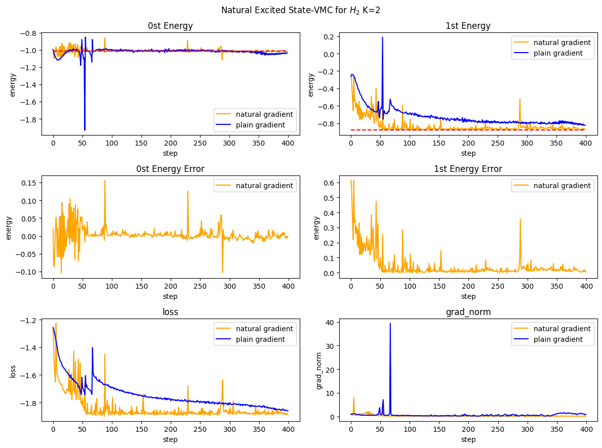
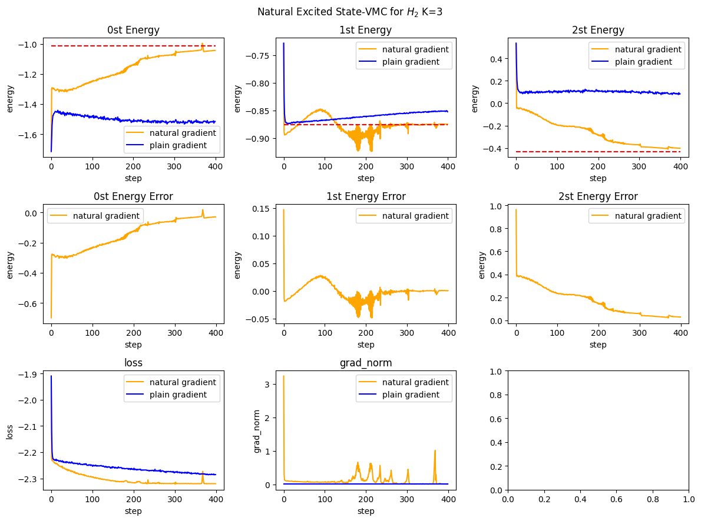

# NES-VMC (Natural Excited State Variational Monte Carlo)

> **注意**: 初めて使用する前に、以下のコマンドで依存関係をインストールしてください:
> ```bash
> pip install -r requirements.txt
> ```

## プロジェクト概要

本プロジェクトは **NetKet フレームワーク** と **Flax.nnx** に基づいて NES-VMC アルゴリズムを実装し、量子多体系（H₂ 分子など）の最初の $K$ 個の励起状態エネルギーを計算します。

**核心思想**: 元系の最初の $K$ 個の励起状態求解問題を「拡張系」の基底状態求解問題に等価変換します。

## アルゴリズム概要

### 拡張希尔伯特空間

$\mathbf{X} = (x_1, \dots, x_N)$ を $N$ 個の粒子を含む粒子セットとし、拡張希尔伯特空間は $K$ 個の元系のコピーのテンソル積で構成され、各配置は $K$ 個の配置 $\mathbf{x} = (x^1, \dots, x^K)$ に対応します。

### TotalAnsatz (全Ansatz)

行列列 $\Psi(\mathbf{x}) \in \mathbb{R}^{K \times K}$ を定義します:

$$
\Psi(\mathbf{x}) \equiv \det\begin{pmatrix}
\psi_1(x^1) & \psi_2(x^1) & \cdots & \psi_K(x^1) \\
\psi_1(x^2) & \psi_2(x^2) & \cdots & \psi_K(x^2) \\
\vdots & \vdots & \ddots & \vdots \\
\psi_1(x^K) & \psi_2(x^K) & \cdots & \psi_K(x^K)
\end{pmatrix}
$$

**重要な性質**: 全 Ansatz を単一状態 Ansatz の行列列として表すことで、異なる Ansatz が同じ状態に崩壊するのを防止できます（明示的に直交性を要求する必要がありません）。

### 損失関数

NES-VMC の目的関数は拡張ハミルトニアンの全 Ansatz に関するレイリー商です:

$$
\mathcal{L} = \frac{\langle\Psi|\tilde{H}|\Psi\rangle}{\langle\Psi|\Psi\rangle} = \mathrm{Tr}\left(\Psi^{-1}\tilde{H}\Psi\right)
$$

### 励起状態エネルギーの抽出

トレーニング後、大量のサンプリングにより局所エネルギーマトリックスを蓄積します: $\bar{E}_L = \mathbb{E}_{\mathbf{x} \sim \Psi^2}[E_L(\mathbf{x})]$。次に、$\bar{E}_L$ を対角化して各励起状態エネルギーを取得します。

## ファイル構成

```
NES-VMC -demo/
├── requirements.txt          # 依存パッケージリスト
├── NES_VMC.py                 # コアアルゴリズム実装
├── NES_VMC_H2_K3日本語版.ipynb # H₂ 分子 K=3 示例notebook
└── NES-VMCコード解读.md          # アルゴリズム詳細解説
```

## コアコンポーネント

| コンポーネント | 説明 |
|------|------|
| `SingleStateAnsatz` | 単一状態 Ansatz: 複素数値 FFNN、单个波動関数を表す |
| `NESTotalAnsatz` | 全 Ansatz: K 個の単一状態の Slater 行列式 |
| `NESFermionHopRule` | カスタムサンプリングルール、拡張状態が重複しないことを確保 |
| `NES_loss_energy` | 損失関数計算 |
| `nes_vmc_gradient` | グラディエント計算 |

## H₂ 分子テストケース

### FCI ベンチマークエネルギー

| 状態 | エネルギー (Ha) | 励起エネルギー (eV) |
|----|----------|-------------|
| E₀ (基底状態) | -1.01546825 | 0.0000 |
| E₁ (第一励起状態) | -0.87542794 | 3.8107 |
| E₂ (第二励起状態) | -0.42938376 | 15.9482 |
| E₃ (第三励起状態) | -0.26922131 | 20.3064 |

### 実行例

```python
from NES_VMC import (
    NESTotalAnsatz, create_machine, create_machine_matrix,
    SingleStateAnsatz, create_single_machine,
    Ham_psi, Ham_Psi, NES_loss_energy, nes_vmc_gradient,
    hi, E_fcis, NESFermionHopRule
)
import flax.nnx as nnx
import optax

K = 3  # NES 拡張コピー数
hi_ext = hi ** K

# Ansatz の初期化
total_ansatz = NESTotalAnsatz(4, K, 12, rngs=nnx.Rngs(11))
total_machine, total_graphdef, total_params = create_machine(total_ansatz)
total_matrix_machine, _, _ = create_machine_matrix(total_ansatz)

# サンプラーの初期化
ext_edges = []
SINGLE_SIZE = hi.size
for k in range(K):
    offset = k * SINGLE_SIZE
    for (i, j) in ((0, 1), (2, 3)):
        ext_edges.append((i + offset, j + offset))

nes_rule = NESFermionHopRule(edges=jnp.array(ext_edges))
nes_sampler = nk.sampler.MetropolisSampler(
    hilbert=hi_ext,
    rule=nes_rule,
    n_chains=16,
    sweep_size=20
)

# オプティマイザー
optimizer = optax.sgd(learning_rate=0.01)
opt_state = optimizer.init(total_params)
```

## サンプリング制約

**重要な制約**: 拡張状態は $x^i \neq x^j$（$i \neq j$ のとき）を満たす必要があります。これは、全 Ansatz の行列式構造が各コピーの配置が互いに異なることを要求するためです。同じ行/列出现在すると、$\Psi(\mathbf{x})$ の行列式がゼロになります。

$K=2$ の場合、拡張状態の合法な構成数は $N_s^2 - N_s = 4^2 - 4 = 12$ です（$N_s=4$ は H₂ 分子の単一系希尔伯特空間の次元）。

## 案例研究

### K=2 示例
[K=2 案例代码](NES_VMC.py#L78-L117) — H₂ 分子の K=2 励起状態計算の実装例

### K=3 示例
[H₂ 分子 K=3 Notebook](NES_VMC_H2_K3日本語版.ipynb) — 完全なトレーニングパイプラインを含む Jupyter notebook

## 現在の困境と解決措施

### 数値不安定性問題

トレーニングの後期段階では、ニューラルネットワークの出力 $\Psi(\mathbf{x})$ の要素が非常に大きいか非常に小さくなることがあります。これにより、以下の問題が発生します：  





| 問題 | 原因 | 影響 |
|------|------|------|
| `jnp.exp(L)` オーバーフロー | $L$ 行列の要素が 1000 を超えると $\exp(1000) \to \infty$ | 損失関数の計算が失敗 |
| `jnp.linalg.solve` 数値誤差 | 行列の条件数が大きくなる | 求解精度が低下 |
| グラディエント爆発 | オーバーフロー時の勾配計算 | トレーニングが不安定 |

### 解決措施：対数領域変換

詳細については [対数領域変換コード解説](NES-VMC_対数領域変換_コード解説.md) を参照してください。

**コア改造点**:

1. **行列安定化**: $L_{\text{stable}} = L - L_{\max}$ — 各行の最大値を減算することで $\exp()$ のオーバーフローを防止
2. **Hamiltonian 行列安定化**: $M_{\text{stable}} = \log(\tilde{H}\Psi) - L_{\max}$ — $\tilde{H}\Psi$ に対しても対数領域で安定化
3. **新規損失関数**: `NES_loss_energy_stable` — 対数領域で行列演算を実行

**数学的同値性**: 共通因子 $e^{L_{\max}}$ は逆行列と行列式計算の両方に同一に作用するため、レイリー商の値は変化しません。

## 依存フレームワーク

- **NetKet**: 量子多体系の変分モンテカルロフレームワーク
- **Flax.nnx**: JAX ベースのニューラルネットワークライブラリ
- **PySCF**: 量子化学計算（H₂ 分子のハミルトニアンの生成に使用）
- **JAX**: 自動微分と高性能計算
